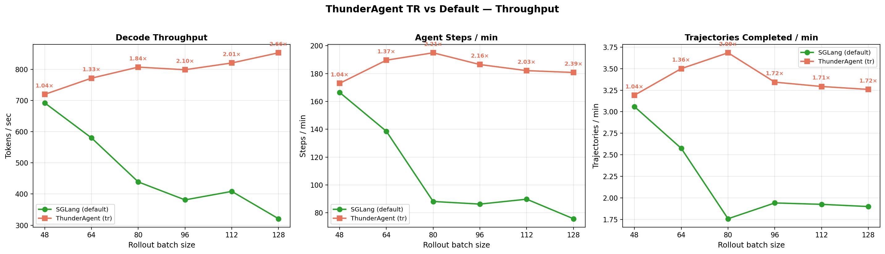
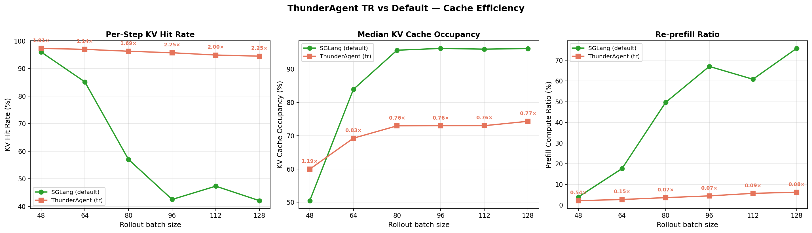

# ThunderAgent + Harbor: SWE-bench Data Generation at Scale

Generate SWE-bench rollout trajectories at scale using [Harbor](https://github.com/harbor-framework/harbor) + [OpenHands](https://github.com/All-Hands-AI/OpenHands) + ThunderAgent + [SGLang](https://github.com/sgl-project/sglang).

**ThunderAgent** acts as a capacity-aware routing proxy between Harbor's parallel trial workers and one or more SGLang inference backends. It tracks per-program KV cache state and pauses new prefills when the radix cache is near capacity, preventing eviction of reusable KV entries.

This example supports two deployment modes:
- **Single backend**: 1 SGLang server + 1 worker node (batch size ablation)
- **Multi backend**: N SGLang servers + M worker nodes (horizontal scaling)

---

## 1. Expected Results

### Single-backend throughput sweep (1 SGLang server, bs=24--128, 120 min runs)





Key observations:

- At low concurrency (bs<=32), the radix cache is large enough for both routers, so TR provides no meaningful benefit.
- A transition zone emerges at bs=40--54 as cache pressure starts causing evictions under the default router.
- At high concurrency (bs>=80), the default router saturates KV cache capacity, causing cascading evictions. TR maintains 2.08--2.48x throughput improvement.
- TR maintains 94--97% KV hit rate across all batch sizes, while default drops from 97% to 36%.

See also: [evicted tokens per request](assets/evicted_per_request.png), [KV hit rate vs agent step](assets/kv_hit_rate_vs_steps.png).

### Multi-backend scaling (2 SGLang servers, 2 workers, bs=128 total, 120 min)

| Setting | Nodes | Eff tok/s | Server gen tok/s | KV Hit (agent) | KV Hit (server) |
|---------|-------|-----------|------------------|----------------|-----------------|
| 1-node bs=128 default | 1 SGLang + 1 worker | 285 | 321 | 36.2% | 42.1% |
| 1-node bs=128 tr | 1 SGLang + 1 worker | 707 | 853 | 94.8% | 94.5% |
| **2-node bs=128 tr** | **2 SGLang + 2 workers** | **1,353** | **1,497** | **95.7%** | **96.2%** |

- 2-node TR achieves **1.91x** effective throughput vs single-node TR (near-linear scaling)
- KV cache hit rate stays at **95.7%** across 2 backends
- Prefill compute ratio only **4.4%** -- 95.6% of prefill tokens served from radix cache

---

## 2. Prerequisites

### Hardware

| Role | Count | Requirements |
|------|-------|-------------|
| SGLang server | N (1+) | 8x NVIDIA H100 80GB GPUs each, 100+ GB host RAM |
| Worker + Docker | M (1+) | 176+ CPU cores, 256+ GB RAM, 1+ TB scratch for Docker images |
| ThunderAgent | 1 | Runs on the login node (no GPU needed) or shares a worker node |

All nodes must share a filesystem (NFS or equivalent) for the Harbor work queue.

### Software

- SLURM cluster with `salloc` and `srun` support
- Rootless Docker (or rootful Docker) on each compute node
- NVIDIA drivers with `nvidia-smi` and CUDA support
- Python 3.12+
- [uv](https://docs.astral.sh/uv/) package manager
- [conda](https://docs.conda.io/) (only if using `conda` SGLang launch mode)
- `curl`, `git`, `bash`

### Data and Accounts

- HuggingFace access to [MiniMaxAI/MiniMax-M2.5](https://huggingface.co/MiniMaxAI/MiniMax-M2.5) (download weights to a shared filesystem)
- Docker Hub account with access to SWE-bench task images (~500 images, ~1.5 TB total)

---

## 3. Setup

### 3.1 Clone OpenHands fork

This example uses a patched OpenHands fork that injects `program_id` into ThunderAgent API calls (O1) and increases HTTP timeouts for high prefill latency (O2):

```bash
git clone https://github.com/Weili-0234/OpenHands.git "$HOME/OpenHands"
cd "$HOME/OpenHands" && git checkout 466454ae0558d576055ccaa087d5ec25d8448c12
```

### 3.2 Download registry.json

Harbor requires a dataset registry file. Download it from the upstream Harbor repo:

```bash
curl -L -o registry.json \
  https://raw.githubusercontent.com/harbor-framework/harbor/72c256a25a65b37d4ae12978bbe2f913da0fc272/registry.json
```

### 3.3 Configure environment variables

```bash
cp env_vars.sh.example env_vars.sh
# Edit env_vars.sh with your cluster-specific paths
```

Key variables:

| Variable | Description |
|----------|-------------|
| `MODEL_PATH` | Absolute path to downloaded MiniMax-M2.5 weights |
| `OPENHANDS_PATH` | Path to the cloned OpenHands fork (default: `$HOME/OpenHands`) |
| `HARBOR_ENV_DIR` | Virtualenv location (default: `harbor-env/` under this directory) |
| `SGLANG_MODE` | SGLang launch mode: `docker`, `docker-mount`, `conda`, or `uv` (default: `docker`) |
| `SGLANG_IMAGE` | SGLang Docker image (default: `lmsysorg/sglang:v0.5.9`) |
| `SGLANG_ADMIN_KEY` | Admin API key for SGLang (used by `--flush-cache`) |
| `SGLANG_EXTRA_ARGS` | Extra flags passed to `sglang.launch_server` (all modes) |
| `DOCKER_DATA_ROOT` | Scratch directory for rootless Docker storage |
| `DOCKER_CREDENTIALS_SCRIPT` | Path to a script that exports `DOCKER_USERNAME` and `DOCKER_TOKEN` |

### 3.4 Install dependencies

```bash
bash scripts/setup/install-deps.sh
```

This creates a virtualenv with Harbor (editable install), ThunderAgent (from repo root), and analysis dependencies (pandas, matplotlib).

### 3.5 Allocate SLURM nodes

```bash
# Single backend: 1 GPU node + 1 CPU node
salloc --gres=gpu:8 -N 1 --time=8:00:00    # -> SGLANG_JOBID, SGLANG_NODE
salloc --gres=gpu:0 -N 1 -c 176 --time=8:00:00    # -> WORKER_JOBID, WORKER_NODE

# Multi backend: N GPU nodes + M CPU nodes
salloc --gres=gpu:8 -N 1 --time=8:00:00    # -> SGLANG_JOBID_1, SGLANG_NODE_1
salloc --gres=gpu:8 -N 1 --time=8:00:00    # -> SGLANG_JOBID_2, SGLANG_NODE_2
salloc --gres=gpu:0 -N 1 -c 176 --time=8:00:00    # -> WORKER_JOBID_1, WORKER_NODE_1
salloc --gres=gpu:0 -N 1 -c 176 --time=8:00:00    # -> WORKER_JOBID_2, WORKER_NODE_2
```

> **Note**: Use `squeue -u $USER` to find hostnames and job IDs. On some clusters, the resolvable hostname differs from the short name in `squeue` (e.g., `research-secure-11` vs `secure-11`). Always verify with `ping <hostname>`.

### 3.6 Set up compute nodes

For each allocated node, initialize Docker:

```bash
srun --jobid <JOBID> --overlap --gpus=0 bash scripts/setup/setup-node.sh
```

Pull SWE-bench task images on each worker node:

```bash
source $HARBOR_ENV_DIR/bin/activate
harbor warmup pull -d swebench-verified
```

This takes 1--3 hours and requires ~1.5 TB of disk.

Pull SGLang Docker image on each SGLang node (`docker`/`docker-mount` modes only):

```bash
srun --jobid <SGLANG_JOBID> --overlap --gpus=0 \
  bash -c 'export XDG_RUNTIME_DIR=/tmp/xdg-$USER && \
           export DOCKER_HOST=unix://$XDG_RUNTIME_DIR/docker.sock && \
           docker pull lmsysorg/sglang:v0.5.9'
```

### 3.7 SGLang launch modes

The SGLang server can be launched in 4 modes, controlled by `SGLANG_MODE` in `env_vars.sh`:

| Mode | When to use | SGLang server runs as |
|------|-------------|----------------------|
| `docker` (default) | Reproducibility -- exact same binary as CI | Docker container from `SGLANG_IMAGE` |
| `docker-mount` | Test local sglang patches without rebuilding image | Docker container + host source mounted in |
| `conda` | Iterate on sglang source with editable install | Native process in a conda environment |
| `uv` | Quick launch from a local sglang checkout | Native process via `uv run` |

For `conda` and `uv` modes, follow the [SGLang installation guide](https://docs.sglang.io/get_started/install.html) to set up your environment:

```bash
git clone -b v0.5.9 https://github.com/sgl-project/sglang.git /path/to/sglang
cd /path/to/sglang
pip install --upgrade pip
pip install -e "python"
```

For `uv` mode, set `SGLANG_UV_PYTHON=3.12` (Python 3.13+ lacks pre-built wheels for some dependencies).

All modes support `SGLANG_EXTRA_ARGS` for passing additional flags to `sglang.launch_server`:

```bash
SGLANG_EXTRA_ARGS="--mem-fraction-static 0.85"
```

---

## 4. Running Experiments

### 4.1 Single SGLang backend

```bash
bash scripts/run/run-experiment.sh \
  --sglang-node $SGLANG_NODE --sglang-jobid $SGLANG_JOBID \
  --worker-node $WORKER_NODE --worker-jobid $WORKER_JOBID \
  --bs 64 --router tr --duration 120
```

The orchestrator:
1. Launches SGLang on the GPU node (using configured `SGLANG_MODE`)
2. Waits for SGLang health check
3. Starts ThunderAgent routing proxy
4. Starts metrics collectors (SGLang Prometheus + nvidia-smi)
5. Starts Harbor coordinator (`harbor run --distributed --manual-workers`)
6. Launches Harbor worker
7. Sleeps for `--duration` minutes
8. Runs `stop-experiment.sh`

### 4.2 Multi SGLang backend

Quick start:

```bash
bash profile-multinode.sh \
  --sglang-nodes $SGLANG_NODE_1:$SGLANG_JOBID_1,$SGLANG_NODE_2:$SGLANG_JOBID_2 \
  --worker-nodes $WORKER_NODE_1:$WORKER_JOBID_1,$WORKER_NODE_2:$WORKER_JOBID_2 \
  --bs 128 --router tr
```

This launches the experiment in the background (no auto-stop) and prints monitoring commands.

For full control:

```bash
nohup bash scripts/run/run-multinode-experiment.sh \
  --sglang-nodes $SGLANG_NODE_1:$SGLANG_JOBID_1,$SGLANG_NODE_2:$SGLANG_JOBID_2 \
  --worker-nodes $WORKER_NODE_1:$WORKER_JOBID_1,$WORKER_NODE_2:$WORKER_JOBID_2 \
  --bs 128 --router tr --duration 300 \
  > /tmp/multinode-experiment.log 2>&1 &
```

### 4.3 Monitoring

```bash
# Live monitor (auto-detects active runs)
python3 monitor-multinode.py

# Side-by-side comparison
python3 monitor-multinode.py --align tr-128-multinode default-128-multinode

# Health checks
curl -s http://localhost:8300/health | python3 -m json.tool     # ThunderAgent
curl -s http://$SGLANG_NODE:8000/health                         # SGLang
```

### 4.4 Stopping

**Single backend**:

```bash
bash scripts/run/stop-experiment.sh \
  --sglang-node $SGLANG_NODE --sglang-jobid $SGLANG_JOBID \
  --worker-node $WORKER_NODE --worker-jobid $WORKER_JOBID
```

**Multi backend** (3 levels of SGLang handling):

```bash
# Keep SGLang as-is (fastest restart, keeps cached KV)
bash scripts/run/stop-multinode-experiment.sh \
  --sglang-nodes $SGLANG_NODE_1:$SGLANG_JOBID_1,$SGLANG_NODE_2:$SGLANG_JOBID_2 \
  --worker-nodes $WORKER_NODE_1:$WORKER_JOBID_1,$WORKER_NODE_2:$WORKER_JOBID_2

# Flush KV cache (server stays up, cache cleared)
# Add: --flush-cache

# Stop SGLang servers (requires model reload next time)
# Add: --stop-sglang
```

---

## 5. Analyzing Results

```bash
source $HARBOR_ENV_DIR/bin/activate

# Single backend
python scripts/analysis/compute_metrics.py --run-dir runs/tr-64/

# Multi backend (aggregates per-backend subdirs)
python scripts/analysis/compute_metrics_multinode.py --run-dir runs/tr-128-multinode/

# Generate comparison plots
python scripts/analysis/plot_comparison.py --results-dir results/
```

---

## 6. Key Integration Points

### Program ID injection (OpenHands O1 patch)

Harbor assigns a unique `HARBOR_PROGRAM_ID` environment variable to each trial. The OpenHands fork (commit `466454ae`) injects this as `extra_body.program_id` on every LLM API call:

```python
# In openhands/llm/llm.py
extra_body["program_id"] = os.environ.get("HARBOR_PROGRAM_ID", "")
```

ThunderAgent uses `program_id` to:
- Track per-program KV cache state across requests
- Make capacity-aware routing decisions (pause programs whose prefix would cause eviction)
- Profile per-step latency and token counts

### Program release (Harbor trial lifecycle)

When a Harbor trial completes, the trial environment is stopped and deleted, which terminates all connections. ThunderAgent detects program inactivity via its step profiler and cleans up internal state automatically.

---

## 7. Key Configuration

| Parameter | Value |
|-----------|-------|
| Model | MiniMaxAI/MiniMax-M2.5 |
| Tensor parallelism | 8 |
| Expert parallelism | 8 |
| HiCache | OFF (known CUDA illegal memory access bug) |
| SGLang image | `lmsysorg/sglang:v0.5.9` |
| Attention backend | FlashAttention 3 (prefill) + FlashInfer (decode) |
| Chunked prefill size | 8192 |
| Page size | 64 |
| Dataset | SWE-bench Verified (500 tasks x 8 rollouts) |
| Agent | OpenHands (CodeAct) |
| Max iterations per trial | 100 |
| Temperature / Top-p / Top-k | 1.0 / 0.95 / 40 |
| ThunderAgent TR params | `--acting-token-weight 1.0 --use-acting-token-decay` |
| Worker resources | 1 CPU, 8192 MB per trial container |
| Network mode | host |

---

## 8. Output Artifacts

Each run produces:

```
runs/<router>-<bs>[-multinode]/
  thunderagent_profiles/
    step_profiles.csv           # Per-step: latency, tokens, KV hit rate, pause time
  sglang_metrics.csv            # SGLang Prometheus: throughput, cache, evictions (single)
  gpu_metrics.csv               # Per-GPU: utilization, memory, temperature, power (single)
  sglang-<nodeA>/               # Per-backend metrics (multi)
    sglang_metrics.csv
    gpu_metrics.csv
  sglang-<nodeB>/
    sglang_metrics.csv
    gpu_metrics.csv
  logs/
    sglang[-<node>].log
    thunderagent.log
    harbor-coordinator.log
    worker[-<node>].log
  experiment.pids               # Node/PID info for stop script
  metrics.json                  # Generated by compute_metrics*.py
```

---

## 9. Repository Layout

```
examples/datagen/harbor/
  README.md                           # This file
  env_vars.sh.example                 # Template for cluster configuration
  profile-multinode.sh                # One-command profiling wrapper (no auto-stop)
  monitor-multinode.py                # Live experiment monitor (multi-backend)
  pyproject.toml                      # Harbor package metadata
  uv.lock                            # Dependency lock for reproducible installs
  assets/                             # Result plots (throughput, cache efficiency)
  scripts/
    setup/
      install-deps.sh                 # Create virtualenv with Harbor + ThunderAgent
      setup-node.sh                   # Initialize Docker on a SLURM compute node
    run/
      run-multinode-experiment.sh     # Multi-node orchestrator
      stop-multinode-experiment.sh    # Graceful shutdown (3 levels)
      run-experiment.sh               # Single-node orchestrator
      stop-experiment.sh              # Single-node shutdown
      launch-sglang.sh               # SGLang launcher (4 modes: docker/docker-mount/conda/uv)
      launch-thunderagent.sh          # ThunderAgent proxy launcher
      launch-worker.sh               # Harbor worker launcher
      collect-metrics.sh             # Periodic metrics collection
    analysis/
      compute_metrics.py              # Single-node metrics
      compute_metrics_multinode.py    # Multi-node aggregate metrics
      plot_comparison.py              # Generate comparison plots
      export_tables.py                # Generate markdown tables
  src/harbor/                         # Harbor framework (patched fork)
  adapters/                           # Benchmark adapters (swebench + others)
```

---

## 10. What We Changed

### Harbor patches (H1--H9)

This example uses a patched fork of [Harbor](https://github.com/harbor-framework/harbor) with the following changes:

| ID | Description |
|----|-------------|
| H1 | Expose `HARBOR_PROGRAM_ID` to agent containers |
| H2 | Support `--manual-workers` in distributed mode |
| H3 | NFS-aware queue file polling with retries |
| H4 | Configurable `--override-cpus` and `--override-memory-mb` |
| H5 | Network mode passthrough (`--network-mode host`) |
| H6 | Graceful worker shutdown on SIGTERM |
| H7 | Fix task retry logic for transient Docker errors |
| H8 | Skip image pull when image already exists locally |
| H9 | base64+exec fallback for `docker cp` lchown failures |

### OpenHands fork patches (O1--O2)

| ID | Description |
|----|-------------|
| O1 | Inject `program_id` from `HARBOR_PROGRAM_ID` into ThunderAgent API calls |
| O2 | Increase HTTP client timeouts for high prefill latency |

---

## 11. Troubleshooting

### Hostname resolution

On some SLURM clusters, short hostnames (e.g., `secure-11`) do not resolve from the login node. Always verify the resolvable hostname with `ping <hostname>`.

### Docker daemon fails to start

Rootless Docker requires `XDG_RUNTIME_DIR` and a writable scratch directory. If a previous daemon died uncleanly, `setup-node.sh` handles cleanup. You can also manually clear stale state:

```bash
rm -f /tmp/xdg-$USER/docker.sock /tmp/xdg-$USER/docker.pid
rm -f /tmp/xdg-$USER/dockerd-rootless/lock
pkill -f 'rootlesskit.*dockerd'
```

### lchown errors during docker cp

SLURM clusters with LDAP UIDs often have UIDs outside the rootless Docker subuid range. Harbor patch H9 adds a base64+exec fallback that avoids the `docker cp` path entirely.

### NFS directory listing cache delays worker startup

When the coordinator writes queue files, workers may not see them for 30--60 seconds due to NFS attribute caching. The orchestrator includes a delay between coordinator start and worker launch, but if workers exit with "queue has 0 pending tasks", increase the delay or restart workers manually.

### OpenHands RuntimeError on cold start

Under high concurrency (64+ containers starting simultaneously), OpenHands sandbox ports can collide, causing `RetryError in _wait_until_alive`. This resolves after the initial wave. Harbor's `--max-retries 3` handles these automatically.

### SGLang container dies when killing srun steps

Killing an srun step kills the entire cgroup, including the Docker daemon. Use `stop-multinode-experiment.sh` for graceful shutdown.

### uv mode fails with "Rust compiler required"

Some SGLang dependencies (e.g., `outlines-core`) lack pre-built wheels for Python 3.13+. Set `SGLANG_UV_PYTHON=3.12` in `env_vars.sh`.

### `conda activate` fails with "unbound variable"

Some conda environments reference undefined shell variables during activation. `launch-sglang.sh` wraps `conda activate` with `set +u` / `set -u` to handle this.
